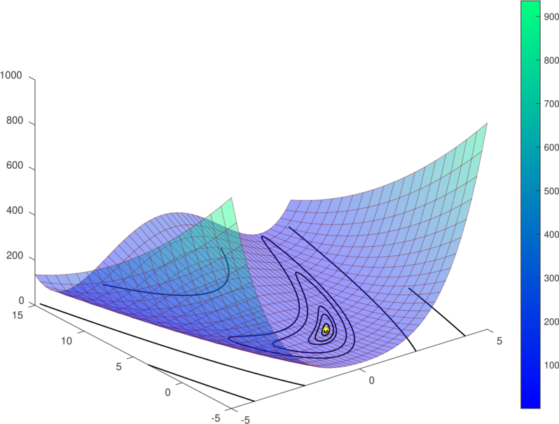

# First-order active-set method

FOAS is [first-order method](https://en.wikipedia.org/wiki/Nonlinear_conjugate_gradient_method) 
for large-scale [non-linear programming (NLP)](https://en.wikipedia.org/wiki/Nonlinear_programming) 
with bound-constraints. 
The nature of the method makes its ideal for solving very
large problems where only the first-order derivatives are necessary.

The following figure shows a 2D version of the [Rosenbrock](https://en.wikipedia.org/wiki/Rosenbrock_function) 
function where the minimum is shown as a yellow point.

Describe where problems it can solve apear.

## Basic example (General problem)
A [basic example of a bound constrained problem] (simpleFOAS.ipynb).

## (A more extendend example in finance?)

## Performace profiles

## A modern replacement for NAG solver `e04dg`
