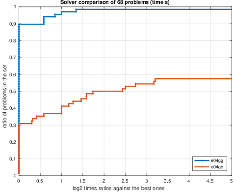
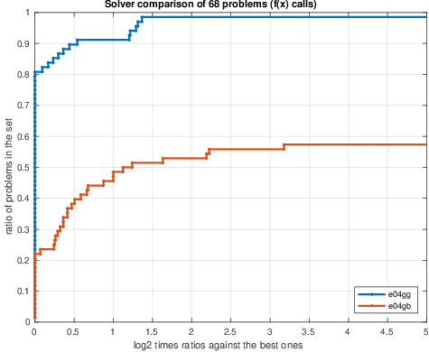
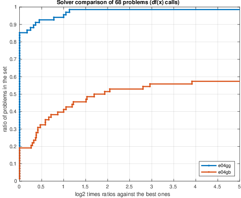

# Nonlinear Least-Squares Trust-Region Method (BXNL)

Data fitting and calibrating parameters of complex numerical models is one of the most common
problems found in numerous industries such as  physics, space exploration, simulations, engineering, amongs many others. 
[NAG](https://www.nag.co.uk/) introduces to the [NAG Library at Mark 27.1](https://www.nag.co.uk/content/nag-library) a novel [nonlinear least-square](https://en.wikipedia.org/wiki/Non-linear_least_squares) [trust-region solver](https://en.wikipedia.org/wiki/Trust_region) for unconstrained or bound-constrained fitting problems ([`e04gg`](https://www.nag.co.uk/numeric/nl/nagdoc_latest/flhtml/e04/e04ggf.html), [`handle_solve_bxnl`](https://www.nag.co.uk/numeric/nl/nagdoc_latest/clhtml/e04/e04ggc.html)). It offers a significant variety of algorithms and regularisation techniques.

The solver [`e04gg`](https://www.nag.co.uk/numeric/nl/nagdoc_latest/flhtml/e04/e04ggf.html) is aimed at small- to mid-scale (100s to 1000s of parameters) bound-constrained nonlinear least-squares problems 
and is also part of the [NAG Optimization Modelling Suite](https://www.nag.co.uk/numeric/nl/nagdoc_latest/flhtml/e04/e04intro.html#optsuite) common handle interface. It offers clarity and consistency of the interface of the solvers within the suite, making it trivial to switch among compatible solvers.

Figure 1 shows an illustrative simple problem of data fitting ([Jupyter Notebook](./notebooks/orbit_ex.ipynb)). The task is to find the optimal orbit path given a variety of measurements for which the orbit has to approximatly pass-by.

<table>
  <tr>
 <td width=50%>
 <td width=50%></td>
</tr>
</table>

**Figure 1.** Example of a NLLS orbital data fitting.
 Given a set of 7 orbital data points the task is to estimate an optimal orbit path that minimizes the error between the path and the fixed data points. For this example assume that expert knowledge provides insight on the reliability of each measument and that for this satellite configuration operational orbit height should around 250 +/-3 units. Center plot shows a simple fit where each measurement (data point) contributes the same amount and provides an optimal orbit height of 238.76 units. The fit is quite poor in the sense that it does not satisfy expert advice. Evidently data point 0 (yellow cross closest to earch surface) unreliablity should be taken into account while doing the fitting. Weights for the residuals should be proportional to the inverse of their variability. For this example suppose we are provided with the accuracy for each of the data measurements, this can be factored using weighted nonlinear least-squares. The rightmost plot shows the weighted optimal solution with orbit height of 254.90 units wich is withing the suggested tolerance. Image credit: [Image of Earth](http://pics.eumetsat.int/viewer/index.html) was taken from [EUMETSAT, Copyright 2020](http://pics.eumetsat.int/viewer/index.html#help).
 
 
# More Info
 1. [BXNL information leaflet]()
 2. [BXNL in the NAG Library for Python](https://www.nag.co.uk/numeric/py/nagdoc_latest/naginterfaces.library.opt.html#naginterfaces.library.opt.handle_solve_bxnl)
 3. [BXNL documentation page](https://www.nag.co.uk/numeric/nl/nagdoc_latest/flhtml/e04/e04ggf.html) [[Python example](https://www.nag.co.uk/numeric/py/nagdoc_latest/naginterfaces.library.opt.html#naginterfaces.library.examples.opt.handle_disable_ex.main), [C example](https://www.nag.co.uk/numeric/nl/nagdoc_latest/clhtml/e04/e04ggc.html#example), [Fortran example](https://www.nag.co.uk/numeric/nl/nagdoc_latest/flhtml/e04/e04ggf.html#example)]
 
 # Unfolding Nuclear Track Data
 
 [[Python Jupyter notebook for this example](./notebooks/simple_BXNL.ipynb)]

This example illustrates the usage of `e04gg` to fit PADC
etched nuclear track data of alpha particles to a convoluted distribution. A target
sheet is scanned and track diameters are recorded (red wedges,
left in Figure 2) into a histogram (Blue bars right plot of Figure 2)
and a mixed Normal and log-Normal model is to be fitted
to the obtained experimental histogram. 

The [Jupyter notebook](./notebooks/simple_BXNL.ipynb) uses `e04gg` to fit the
six parameter model φ(t, x = (a,b,Al,μ,σ,Ag)) = Al log-Normal(a, b) + Ag Normal(μ, σ) with 0 ≤ x,
using as data the histogram heights. The NLLS solution provides the unfolded
parameters for the two distributions (red and blue curves in right plot in Figure 2). 
Adding these together produces the green curve which is the one used to perform the fitting with.

<table>
<tr>
<td valign="top" width=50% ></td>
<td width=50%></td>
</tr>
</table>

**Figure 2.** Left: example of a PADC target with alpha 
particle etched tracks, wedges in red show the track diameter. 
Right: experimental data histogram of track diameters (blue bars), 
aggregated model used in the fitting (green curve) and unfolded models (blue and red curves).
Optimal parameter values are reported in the legend.

# Modern Replacement Alternative
Solver [`e04gg`](https://www.nag.co.uk/numeric/nl/nagdoc_latest/flhtml/e04/e04ggf.html) is a modern and attractive replacement for the unconstrained nonlinear least-squares solver [`e04gb`](https://www.nag.co.uk/numeric/nl/nagdoc_latest/flhtml/e04/e04gbf.html) introduced at Mark 7. 

More recent and modern methods have been incorporated into [`e04gg`](https://www.nag.co.uk/numeric/nl/nagdoc_latest/flhtml/e04/e04ggf.html) making it much faster than [`e04gb`](https://www.nag.co.uk/numeric/nl/nagdoc_latest/flhtml/e04/e04gbf.html). Our benchmarks comparing [`e04gg`](https://www.nag.co.uk/numeric/nl/nagdoc_latest/flhtml/e04/e04ggf.html) to [`e04gb`](https://www.nag.co.uk/numeric/nl/nagdoc_latest/flhtml/e04/e04gbf.html) using 68 unconstrained nonlinear least-squares CUTEst problems is reported in Figure 3 using performance profiles. 

Contrasting the three plots, it can be seen that the new solver is more efficient in time: solves 60%
of the problems faster (left plot). In general terms it is more robust (solves 25% more problems) and less expensive in terms of user call-backs: 55% of problems
require less function calls (center plot) and 65% of the problems require less gradient evaluations (right plot).

[`e04gg`](https://www.nag.co.uk/numeric/nl/nagdoc_latest/flhtml/e04/e04ggf.html) 
should present significant improvement for unconstrained or bound-constrained nonlinear 
least-squares solvers in the NAG Library and current users of [`e04gb`](https://www.nag.co.uk/numeric/nl/nagdoc_latest/flhtml/e04/e04gbf.html) ([`lsq_uncon_quasi_deriv_comp`](https://www.nag.co.uk/numeric/nl/nagdoc_latest/clhtml/e04/e04gbc.html) ) 
are highly encourage to try out the new solver.

<table>
  <tr>
 <td width=30%>
 <td width=30%>
 <td width=30%>
</tr>
</table>

**Figure 3.** Performance profiles comparing solvers e04gg and e04gb over 68 CUTEst unconstrained nonlinear least-squares problems.
Performance measure are: time in seconds (left), number of function calls (center) and number of gradient calls
(right). For the time plot (left), higher line indicates faster solver. For the center and right plots, higher line
represent less functions and gradients calls.

# References

 * Gould N I M, Rees T, and Scott J A (2017) _A higher order method for solving nonlinear least-squares problems_. Technical report, RAL-P-1027-010 RAL Library. STFC Rutherford Appleton Laboratory http://www.numerical.rl.ac.uk/people/rees/pdf/RAL-P-2017-010.pdf
 * Kanzow C, Yamashita N, and Fukushima M (2004) _Levenberg-Marquardt methods with strong local convergence properties for solving nonlinear equations with convex constraints_. Journal of Computational and Applied Mathematics 174 375–397
 * Nocedal J and Wright S J (2006) _Numerical Optimization_. (2nd Edition) Springer Series in Operations Research, Springer, New York 
 * Adachi S, Iwata S, Nakatsukasa Y, and Takeda A (2015) _Solving the trust region subproblem by a generalized eigenvalue problem_. Technical report, METR 2015-14. Mathematical Engineering, The University of Tokyo https://www.keisu.t.u-tokyo.ac.jp/data/2015/METR15-14.pdf
 * Conn A R, Gould N I M and Toint Ph L (2000) _Trust Region Methods_. SIAM, Philadephia

<!-- foot banner for commercial material -->
