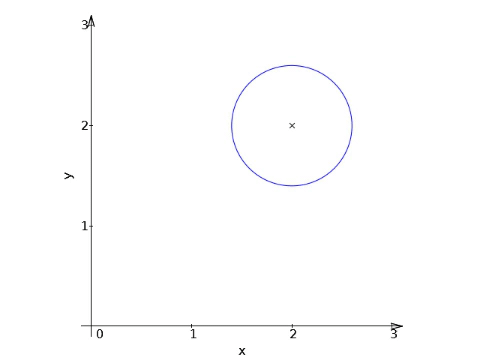

# Derivative-Free Optimization (DFO)

DFO solvers are aimed at optimizing _black box_ models and can handle either calibration (nonlinear least squares) problems (DFLS) 
or problems with a generic objective function (DFNO).

* Calibration: DFLS (Derivative Nonlinear least squares)
[[`handle_solve_dfls`](https://www.nag.co.uk/numeric/py/nagdoc_latest/naginterfaces.library.opt.html#naginterfaces.library.opt.handle_solve_dfls) | 
[`e04fff`](https://www.nag.co.uk/numeric/nl/nagdoc_latest/flhtml/e04/e04fff.html) | 
[`e04ffc`](https://www.nag.co.uk/numeric/nl/nagdoc_latest/clhtml/e04/e04ffc.html) ]

 * DFNO (Derivative-Free Nonlinear Optimization) 
 [[`handle_solve_dfno`](https://www.nag.co.uk/numeric/py/nagdoc_latest/naginterfaces.library.opt.html#naginterfaces.library.opt.handle_solve_dfno) | 
 [`e04jdf`](https://www.nag.co.uk/numeric/nl/nagdoc_latest/flhtml/e04/e04jdf.html) | 
[`e04jdc`](https://www.nag.co.uk/numeric/nl/nagdoc_latest/clhtml/e04/e04jdc.html) ]

Optimizing complex numerical models is one of the most common problems found in the industry (finance, multi-physics simulations, 
engineering, etc.). To solve these optimization problems with a standard optimization algorithm such as 
[Gauss–Newton](https://en.wikipedia.org/wiki/Gauss%E2%80%93Newton_algorithm) (for 
problems with a nonlinear least squares structure) or 
[CG](https://en.wikipedia.org/wiki/Conjugate_gradient_method) (for unstructured nonlinear objective) requires good estimates 
of the model's derivatives. 

If exact derivatives are easy to compute then using derivative-based methods is preferable. However, explicitly writing the derivatives 
or applying [AD methods](https://www.nag.com/content/algorithmic-differentiation-software) might be impossible if the model is a black box. 
The alternative, estimating derivatives via [finite differences](https://en.wikipedia.org/wiki/Finite_difference#Relation_with_derivatives), 
can quickly become impractical or too computationally expensive.

**Figure 1.** Animation showing 2 iterations of a model-based DFO algorithm [`handle_solve_dfls`](https://www.nag.co.uk/numeric/py/nagdoc_latest/naginterfaces.library.opt.html#naginterfaces.library.opt.handle_solve_dfls).

## Poster
<table><tr>
<td valign="top">A 2019 poster discussing NAG's DFO/DFLS functionality 
<a href="https://www.nag.com/market/posters/derivative_free_optimization_solver_calibration_problems.pdf">is available on the NAG website</a>.</td>
<!--- td>&nbsp;&nbsp;&nbsp;&nbsp;&nbsp;&nbsp;&nbsp;&nbsp;&nbsp;&nbsp;&nbsp;</td --->
<td></td>
</tr></table>

## Example 

The Jupyter notebook showcases the optimization of noisy problems where the objective function is not deterministic. 
The example discuses and illustrates the advantages of using a DFO solver instead of a derivative-based solver using 
finite difference estimations for the gradient.

  * [Noisy problem notebook.](DFO_noisy.ipynb)

## More information 

 * [Informative Leaflet](https://www.nag.com/content/derivative-free-optimization-dfo)
 
 * Blog post from the OptCorner [The price of derivatives - Derivative-free Optimization](https://www.nag.com/blog/optcorner-price-derivatives-derivative-free-optimization)
 
 * [DFO/DFLS in the NAG Library for Python](https://www.nag.co.uk/numeric/py/nagdoc_latest/naginterfaces.library.opt.html#naginterfaces.library.opt.handle_solve_dfls)

 * Examples [ [Python example](https://www.nag.com/numeric/py/nagdoc_latest/naginterfaces.library.opt.html#naginterfaces.library.examples.opt.handle_solve_dfls_ex.main) | [C example](https://www.nag.co.uk/numeric/nl/nagdoc_latest/clhtml/e04/e04ffc.html#example) | [Fortran 90 example](https://www.nag.co.uk/numeric/nl/nagdoc_latest/flhtml/e04/e04fff.html#example) ]

 * [DFO/DFNO in the NAG Library for Python](https://www.nag.co.uk/numeric/py/nagdoc_latest/naginterfaces.library.opt.html#naginterfaces.library.opt.handle_solve_dfno)
 
 * Examples [ [Python example](https://www.nag.com/numeric/py/nagdoc_latest/naginterfaces.library.opt.html#naginterfaces.library.examples.opt.handle_solve_dfno_ex.main) | [C example](https://www.nag.co.uk/numeric/nl/nagdoc_latest/clhtml/e04/e04jdc.html#example) | [Fortran 90 example](https://www.nag.co.uk/numeric/nl/nagdoc_latest/flhtml/e04/e04jdf.html#example) ]

## References

* C. Cartis, J. Fiala, B. Marteau, and L. Roberts (2019) _Improving the Flexibility and robustness of 
  model-based derivative-free optimization solvers_. ACM Transactions On Numerical Software.
* C. Cartis and L. Roberts (2017) _A derivative-free Gauss–Newton method_. Mathematical Programming Computation.
* Powell M. J. D. (2009) _The BOBYQA algorithm for bound constrained optimization without derivatives_. Report DAMTP 2009/NA06 University of Cambridge.

<!-- foot banner for commercial material -->

# Obtaining the NAG Library for Python

 * Instructions on [how to install the NAG Library for Python](../Readme.md#install)
 * Instructions on [how to run the Jupyter notebooks in the Repository](../Readme.md#jupyter)

