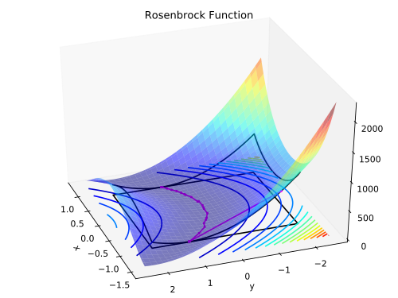
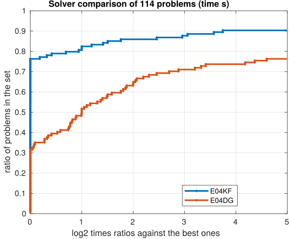
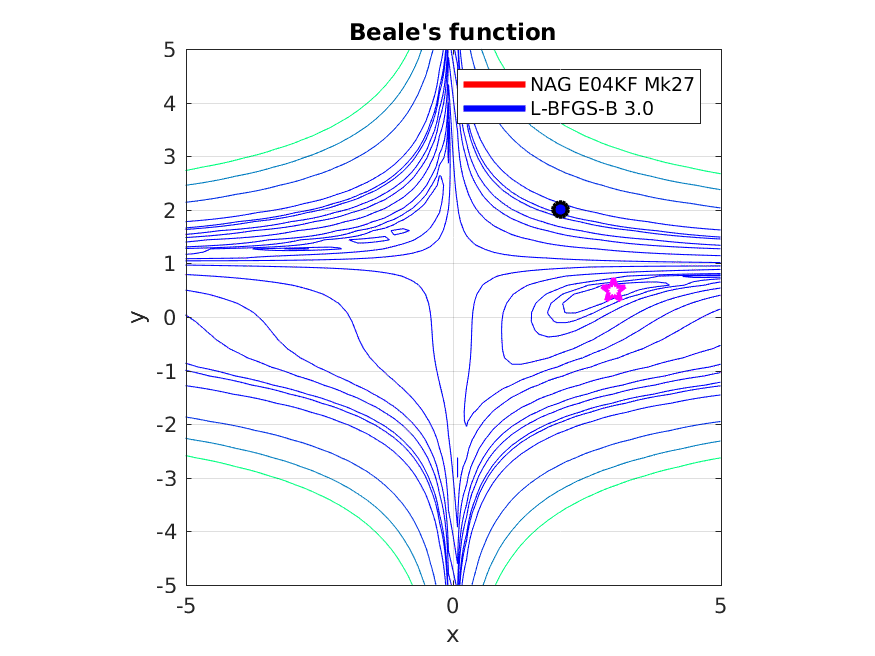

# First-order active-set method (FOAS, [e04kf](https://www.nag.co.uk/numeric/nl/nagdoc_latest/flhtml/e04/e04kff.html))

Implementations of first-order methods not only are ubiquitous and have a widespread use, they have also demonstrated to endure the challenges of ever-growing problems sizes imposed by the industry. Most notable are applications in statistics, e.g. parameter calibration for log-linear models, conditional random fields (L2-regularisation) or logistic multi-class regression, amongs many other. First-order methods and the Conjugate Gradient method inparticular have been a research subject for well over 50 years and continue to be improved.

FOAS is a [first-order nonlinear conjugate method](https://en.wikipedia.org/wiki/Nonlinear_conjugate_gradient_method) for large-scale bound-constrained nonlinear optimization. The solver is ideal for very large problems (tens of thousands or more variables) where the first-order derivatives are available or are relatively _cheap_ to estimate.

e04kf is also part of the [NAG Optimization Modelling Suite](https://www.nag.co.uk/numeric/nl/nagdoc_latest/flhtml/e04/e04intro.html#optsuite) common handle interface. It offers clarity and consistency of the interface of the solvers within the suite, making it trivial to switch among compatible solvers.

The following example illustrates the simple usage of FOAS to solve the bound-constrained 2D version of the [Rosenbrock function](https://en.wikipedia.org/wiki/Rosenbrock_function) which is a classical test function to measure and profile performance of solvers. Source of this example is avaible in [rosenbrock2d.ipynb](rosenbrock2d.ipynb).

<table><tr>
<td></td>
 <td></td>
</tr></table>

**Figure 1.** 2D Rosenbrock function, (left) the minimum is shown as a yellow dot at x=(1,1). On the right a bound constrained version showing with a purple dotted line a path towards the constrained solution point on the border.

# More information 
 1. [FOAS information page](https://www.nag.com/content/limited-memory-nonlinear-conjugate-gradient-solver)
 2. [FOAS in the NAG Library for Python](https://www.nag.co.uk/numeric/py/nagdoc_latest/naginterfaces.library.opt.html#naginterfaces.library.opt.handle_solve_bounds_foas)
 3. [FOAS documentation page](https://www.nag.co.uk/numeric/nl/nagdoc_latest/clhtml/e04/e04kfc.html) [ [Fortran 90](https://www.nag.co.uk/numeric/nl/nagdoc_latest/flhtml/e04/e04kff.html) | [C](https://www.nag.co.uk/numeric/nl/nagdoc_latest/clhtml/e04/e04kfc.html)  ]
 4. Examples [ [Python example](https://www.nag.co.uk/numeric/py/nagdoc_latest/naginterfaces.library.opt.html#naginterfaces.library.examples.opt.handle_solve_bounds_foas_ex.main) | [C example](https://www.nag.co.uk/numeric/nl/nagdoc_latest/clhtml/e04/e04kfc.html#example) | [Fortran example](https://www.nag.co.uk/numeric/nl/nagdoc_latest/flhtml/e04/e04kff.html#example) ]

# A modern replacement for NAG solver [e04dg](https://www.nag.co.uk/numeric/nl/nagdoc_latest/flhtml/e04/e04dgf.html)
One of the main design objectives for e04kf was to provide a modern and attractive replacement for the CG solver e04dg introduced in Mark 12. While this solver was targeted for unconstrained NLPs, e04kf has been extended with an active-set method in order to solve bound-constrained NLPs.

More recent and modern methods have been incorporated into e04kf making it much faster than e04dg. The following Figure 2 reports performance profiles over 114 unconstrained NLP CUTEst problems for both solvers e04kf and e04dg. Contrasting the three plots, it is evident that the new solver is more efficient in time (40% faster) and in general terms is less expensive: requires less function and gradient evaluations.

<table><tr>
<td></td>
<td></td>
<td></td>
</tr></table>

**Figure 2.** Performance profiles comparing solvers e04kf and e04dg. In the time plot on the left, higher line indicates faster solver. For the center and right plots higher line represent less functions (NF) or gradients (NG) calls. For all three plots it can be seen that e04kf is 40% faster in time and requires less function and gradient calls.

# Migrating from [e04dg](https://www.nag.co.uk/numeric/nl/nagdoc_latest/flhtml/e04/e04dgf.html) (Mark 26.x) to [e04kf](https://www.nag.co.uk/numeric/nl/nagdoc_latest/flhtml/e04/e04kff.html) (Mark 27+)

Notes and comments on migrating your code to the new FOAS solver:

 * [Python](migration/migration_e04dg_e04kf.ipynb)
 * [Fortran 90](https://www.nag.com/numeric/nl/nagdoc_latest/flhtml/genint/replace.html#e04dgf)
 * [C](https://www.nag.com/numeric/nl/nagdoc_latest/clhtml/genint/replace.html#e04dgc)

# Beale's function
This example compares the steps taken by FOAS and L-BFGS-B 3.0 to find the solution point to [Beale's function](https://en.wikipedia.org/wiki/Test_functions_for_optimization). It is a classic nonconvex test function used to benchmark nonlinear optimization solvers.

Both solvers are used to find a minimum to the function and are started at the same initial point (2, 2). The following figure shows an animation of the steps taken by each solver to find a minimum to the function. 
It illustrates the agressive steps taken by the [Conjugate Gradient method](https://en.wikipedia.org/wiki/Conjugate_gradient_method) compared to the more conservative steps of BFGS.

**Figure 3.** Contour plots for Beale's function (thin blue lines), and the steps taken by FOAS (red) and L-BFGS-B 3.0 (blue) to find the minimum of Beale's funtion at (3, 0.5) marked with a magenta star in the. It can be seen that FOAS by the 8th step provides a reasonable approximation to the solution point while L-BFGS-B is still relatively far from it. 

# References

 * Hager W W and Zhang H (2005) _A New Conjugate Gradient Method with Guaranteed Descent and an Efficient Line Search_. SIAM J. Optim. 16(1) 170–192
 * Hager W W and Zhang H (2006a) _Algorithm 851: CG DESCENT, a Conjugate Gradient Method with Guaranteed Descent_. ACM Trans. Math. Software 32(1) 113–137
 * Hager W W and Zhang H (2006b) _A New Active Set Algorithm for Box Constrained Optimization_. SIAM J. Optim. 17(2) 525–557
 * Hager W W and Zhang H (2013) _The Limited Memory Conjugate Gradient Method_. SIAM J. Optim. 23(4) 2150–2168
 * Nocedal J and Wright S J (2006) _Numerical Optimization_. (2nd Edition) Springer Series in Operations Research, Springer, New York 

<!-- foot banner for commercial material -->

