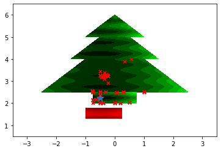
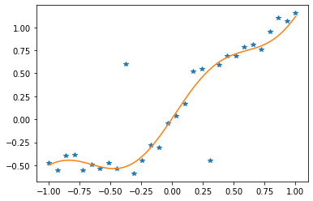

# Modelling Optimization Problems

In this folder you will find notebook examples, tips and tricks related to modeling optimization problems.

* **Christmas Special** [How to decorate your Christmas tree (Notebook)](christmas_demo.ipynb) 
   or view the [Blog-post](https://www.nag.com/blog/optcorner-christmas-edition).
<table><tr>

<td></td>

<td valign="top">See how optimization can help to decorate a Christmas tree...</td>
</tr></table>  
   
   
* **Demo** [Linear Programming (LP)](LP_demo.ipynb).
   
   Tiny and Cute LP problem...
* **Demo** [Nonlinear calibration (data fitting)](handle_disable_ex.ipynb).

   This demo shows useful features of the [NAG Optimization Modelling Suite (NOMS)](https://www.nag.com/numeric/nl/nagdoc_latest/flhtml/e04/e04intro.html#optsuite) in [Nonlinear Least-squares]() problem.
   
<table><tr>
<td></td>
   
<td valign="top">This demo shows useful features of the <a href="https://www.nag.com/numeric/nl/nagdoc_latest/flhtml/e04/e04intro.html#optsuite">NAG Optimization Modelling Suite (NOMS)</a> in a Nonlinear Least-squares problem.</td>
   
</tr></table>  
   
   
* **Demo** [Production Planning](production_planning.ipynb).
 
   Optimal production planning showcasing features of the [NAG Optimization Modelling Suite (NOMS)](https://www.nag.com/numeric/nl/nagdoc_latest/flhtml/e04/e04intro.html#optsuite).
 
# Useful Links
* [Background to Optimization Methods](https://www.nag.com/numeric/nl/nagdoc_latest/flhtml/e04/e04intro.html#algorithms)
* [Nag Blog](https://www.nag.com/content/nag-blog)

<!-- When ready add links?
* Blog-post: Introducing the NAG Optimization Modelling Suite (NOMS)
* The right tool for the job I – matching problem with optimizer
* Blog-post: The right tool for the job II - dense vs. sparse
--->

<!-- foot banner for commercial material -->

# Obtaining the NAG Library for Python

 * Instructions on [how to install the NAG Library for Python](../Readme.md#install)
 * Instructions on [how to run the Jupyter notebooks in the Repository](../Readme.md#jupyter)
