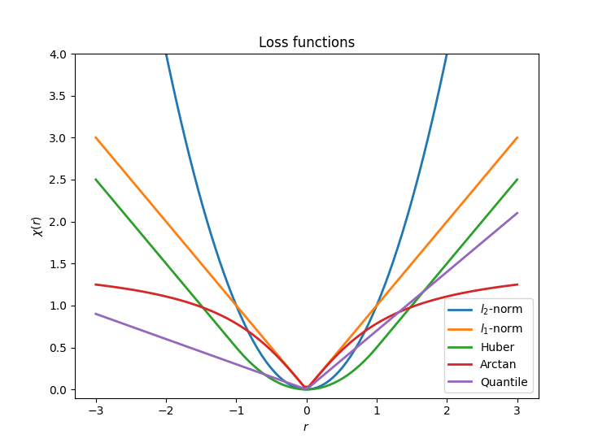
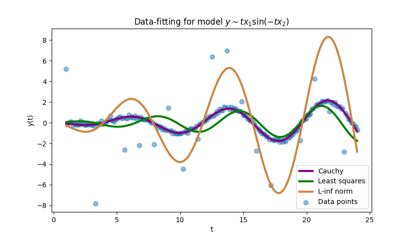

# General Nonlinear Data-Fitting (NLDF)
[[`handle_solve_nldf`](https://www.nag.com/numeric/py/nagdoc_latest/naginterfaces.library.opt.handle_solve_nldf.html) | [`e04gnf`](https://www.nag.com/numeric/nl/nagdoc_latest/flhtml/e04/e04gnf.html) | [`e04gnc`](https://www.nag.com/numeric/nl/nagdoc_latest/clhtml/e04/e04gnc.html) ]

Data fitting/calibration is widespread. Commonly used in by those needing to fit a mathematical model to an experimental data set. Application use is found, but not limited to, econometrics and finance, image processing, civil engineering, mechanical engineering, and astronomy. Widely used methods, such as the [least squares (LSQ) method](../BXNL/Readme.md), don’t always capture the underlying data distribution. When the assumptions are unrealistic or the data set contains various level of outliers, the need for robustness appears.

Figure 1 shows the shapes of different loss functions and their performance in dealing with a data set that has outliers. Clearly in this case, the Cauchy loss function provides the best fit, and the model using infinity norm is heavily influenced by the outliers.
<table>
  <tr>
 <td width=45%>
 <td width=55%></td>
</tr>
</table>

**Figure 1.** Left: plot of various loss functions. Right: fitting results via various loss functions 

Within the [NAG&reg; Library](https://www.nag.co.uk/content/nag-library) is a [nonlinear data fitting solver](https://www.nag.com/numeric/py/nagdoc_latest/naginterfaces.library.opt.handle_solve_nldf.html), which encapsulates a selection of calibration models (the loss function and regularization types), such as Least Absolute Value and Cauchy, making it a great starting point for the journey of exploring the nonlinear nature of your experimental data. In addition, the models can include general constraints such as bound, linear, quadratic, and nonlinear constraints. The switching between different types of models and regularizations is very easy.

See the notebook below for the usage of [`handle_solve_nldf`](https://www.nag.com/numeric/py/nagdoc_latest/naginterfaces.library.opt.handle_solve_nldf.html) and a further discussion on the performance of loss functions regarding robustness.

* [Loss functions and robustness in data-fitting](data_fitting_robustness.ipynb)
