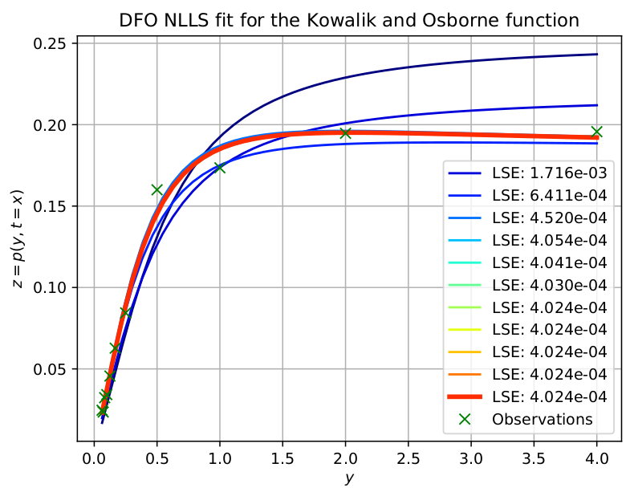
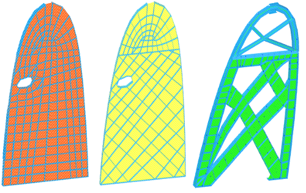
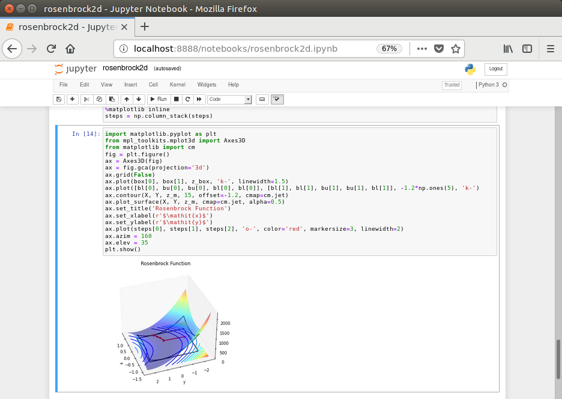

[](https://www.nag.com)

# Local Optimization<a name=top></a>

Here you will find a variety of resources (mostly [Jupyter notebooks](https://jupyter.org/)) related to the use of our optimization routines and modelling suite. If you are new to NAG's optimization solvers we highly recomment to read the [E04 chapter](https://www.nag.com/numeric/nl/nagdoc_latest/clhtml/e04/e04intro.html) of the [NAG](https://www.nag.com) Library which is dedicated to local optimization. While if you are new to NAG Library for Python we encourage to review the [NAG Python documentation](https://www.nag.com/numeric/py/nagdoc_latest/naginterfaces.library.opt.html) and read the sections on [How to install the NAG Library for Python](#install) and [How to run the Jupyter notebook examples](#jupyter) of this `Readme`. 

If you are already familiar with NAG's optimization offering and just need to find the right solver to use for your problem, then we recommend reviewing the [Optimization Index](https://www.nag.com/numeric/nl/nagdoc_latest/flhtml/indexes/optimization.html) or the [Decision Tree for selecting the right Optimization solver](https://www.nag.com/numeric/nl/nagdoc_latest/flhtml/e04/e04intro.html#dtree).


<table><tr>
<td></td>
  <td>&nbsp;&nbsp;&nbsp;&nbsp;&nbsp;&nbsp;&nbsp;&nbsp;&nbsp;&nbsp;&nbsp;</td>
 <td></td>
</tr></table>

**Figure 1.** Applied optimization examples. (left) DFO nonlinear least-square calibration for the Kowalik and Osborne function, 
red line shows the final solution. (right) Optimization of a wing section struct: red represent the baseline design, center section in yellow 
shows a design with an overall improvement of 13% while the rightmost section in green/blue shows design with a further 33% improvement. Improvement metric is
based on weight and strengh of the piece.

# Content<a name=content></a>

* [How to install the NAG Library for Python](#install)
* [How to run the Jupyter notebook examples](#jupyter)
* [Useful links](#links)

### Repository

* [Second Order Cone Programming (SOCP)](./SOCP/)
* [First order active set CG (FOAS)](./FOAS/)
* [Nonlinear Least-Squares (BXNL)](./BXNL)
* [Semi-Definite Programming (SDP)](./SDP/)
* [Derivative-Free Optimization (DFO)](./DFO/)
* [Tips and Tricks in modelling](./Modelling/)
* [Assortment of example notebooks](./Notebooks)  


# How to install the NAG Library for Python<a name=install></a>

In this section we illustrate how to install the NAG Library for Python, request a Trial Licence and make sure the Library is working. Details and further information regarding the installation can be found [here](https://www.nag.com/numeric/py/nagdoc_latest/readme.html#installation).

**Note** Before starting make sure you have access to a host that has Python 3 (3.4 or more recent).

### Step 1. Downloading and installing
Installing the NAG Library is done using the `pip` package manager, fire-up a terminal and create a Python 3 virtual environment where to install and test the NAG Library
```{bash}
guest@nag-37:~$ python3 -m venv nag3
guest@nag-37:~$ . nag3/bin/activate
(nag3) guest@nag-37:~$
```
Now use `pip` to install the NAG Library for Python
```{bash}
(nag3) guest@nag-37:~$ python -m pip install --extra-index-url https://www.nag.com/downloads/py/naginterfaces_nag naginterfaces
```
or if you prefer the version of the package that relies on Intel MKL for optimized linear algebra routines, then use
```{bash}
(nag3) guest@nag-37:~$ python -m pip install --extra-index-url https://www.nag.com/downloads/py/naginterfaces_mkl naginterfaces
```

The output should be similar to
```{bash}
Collecting naginterfaces
  Downloading https://www.nag.com/downloads/py/naginterfaces_nag/naginterfaces/naginterfaces-27.1.0.0-py2.py3-none-linux_x86_64.whl (55.8MB)
    100% |████████████████████████████████| 55.8MB 21kB/s 
Collecting numpy>=1.15 (from naginterfaces)
  Downloading https://files.pythonhosted.org/packages/45/b2/6c7545bb7a38754d63048c7696804a0d947328125d81bf12beaa692c3ae3/numpy-1.19.5-cp36-cp36m-manylinux1_x86_64.whl (13.4MB)
    100% |████████████████████████████████| 13.4MB 70kB/s 
Installing collected packages: numpy, naginterfaces
Successfully installed naginterfaces-27.1.0.0 numpy-1.19.5
```
The output indicates that the installation was successful.

### Step 2. Getting a trial licence
The next step is to get the licensing info (**product code** and **KUSARI ID**) and use it to request a licence. From the same virtual terminal, try
```{bash}
(nag3) guest@nag-37:~$ python -m naginterfaces.kusari
```
The output should be similar to
```
The NAG Library for Python on this platform uses
underlying Library NLL6I271VL.
This Library has been installed as part of the package
and it requires a valid licence key.
No such key could be validated:
the key may not have been installed correctly or
it may have expired.
The Kusari licence-check utility reports the following:
User: guest
Directory: /home/guest
NAG_KUSARI_FILE=""
File /home/guest/nag.key does not exist
-------------------------------------------------------------------------------
Error: Licence not found; this product requires a key for NLL6I271VL
The above information has been generated on machine nag-37
For information on how to obtain a licence, please see
https://www.nag.com/numeric/py/nagdoc_latest/naginterfaces.kusari.html
KUSARI ID = "ADLXt-adEclJLmvnxlrU2sseteZoo,RopA-Ld"
```
The **two** important bits are the 

 1. **product code** shown as **`underlying Library NLL6I271VL.`** which identifies the licence to request, and
 
 2. **KUSARI ID** shown as **`KUSARI ID = "ADLXt-adEclJLmvnxlrU2sseteZoo,RopA-Ld"`** which identifies the host you are running the library on.
 
 **Note** that the **product code** and **KUSARI ID** can be different from the previous example.
 
 With these, you are set to [contact NAG and request a trial licence](https://www.nag.com/content/software-trials?product=NAG%20Library).
 
 The trial licence is a plain text chunk similar to
 ```
 NLL6I271V TRIAL 2021/01/27 "RverXn0Pc-Ib?ctdgF=Wpis2j7I"
 ```
 Save or copy the text into the file `/home/guest/nag.key`.
 
 The final step is to make sure the licence is valid and the library is working as expected.
 
### Step 3. Testing the NAG Library
The last step is to make sure the licence was correctly stored and that the NAG Library is working correctly. From the same virtual terminal re-run the Kusari licence module
```{bash}
(nag3) guest@nag-37:~$ python -m naginterfaces.kusari
``` 
This time the output should be similar to
```
Licence available; the required NLL6I271VL licence key for this product is valid
TRIAL licence, 27 days remaining (licence from file)
```
Now let's try a more interesting example ([list of optimization examples](https://www.nag.com/numeric/py/nagdoc_latest/naginterfaces.library.opt.html#examples))

This command runs the example for the [FOAS (First-Order Active set method) solver and minimizes the Rosenbrock 2D function](./FOAS).
```
(nag3) guest@nag-37:~$ python -m naginterfaces.library.examples.opt.handle_solve_bounds_foas_ex
```
Should generate an outputsimilar to
```{bash}
Trying:
    main()
Expecting:
    naginterfaces.library.opt.handle_solve_bounds_foas Python Example Results.
    Minimizing a bound-constrained Rosenbrock problem.
     E04KF, First order method for bound-constrained problems
...
     Status: converged, an optimal solution was found
     Value of the objective             4.00000E-02
    ...
ok
```
indicating that the example was successfully executed. The source code can be found [here](https://www.nag.com/numeric/py/nagdoc_latest/_modules/naginterfaces/library/examples/opt/handle_solve_bounds_foas_ex.html#main).

### Running more examples

To display the full list of example source files on disk, but not run them, execute
```
python -m naginterfaces.library.examples --locate
```
All examples may be executed sequentially by running
```
python -m naginterfaces.library.examples
```
Run `python -m naginterfaces.library.examples --help` to see any additional usage.


# How to run the Jupyter notebook examples<a name=jupyter></a>

This section briefly illustrates how to setup a host in order to open and run the [Jupyter notebooks](https://jupyter.org/) provided in this repository.
Before running the notebooks make sure the [NAG Library is installed and working](#install). Before starting, it is advised to read [Jupyter's installation page](https://jupyter.org/install.html).

<!-- You can [view a static render of the notebooks using Jupyter's nbviewer here](https://nbviewer.jupyter.org/github/numericalalgorithmsgroup/NAGPythonExamples/tree/master/local_optimization/) 
[](https://nbviewer.jupyter.org/github/numericalalgorithmsgroup/NAGPythonExamples/tree/master/local_optimization/)
or alternatively use [Binder](https://mybinder.org/) to [view them here](https://mybinder.org/v2/gh/numericalalgorithmsgroup/NAGPythonExamples/HEAD) 
[](https://mybinder.org/v2/gh/numericalalgorithmsgroup/NAGPythonExamples/HEAD). -->


### Installing Jupyter notebook
To install Jupyter, launch a terminal and activate the virtual environment used to install the NAG Library for Python
```{bash}
guest@nag-37:~$ . nag3/bin/activate
(nag3) guest@nag-37:~$ pip install notebook matplotlib
Collecting notebook
  Downloading https://files.pythonhosted.org/packages/74/19/50cd38acf22e33370d01fef764355f1e3517f6e12b4fceb8d434ece4f8fd/notebook-6.2.0-py3-none-any.whl (9.5MB)
    100% |████████████████████████████████| 9.5MB 115kB/s 
Collecting argon2-cffi (from notebook)
...
Successfully installed jupyter-client-6.1.11 jupyterlab-pygments-0.1.2 ... wcwidth-0.2.5
```
This indicates that Jupyter and matplotlib were successfully installed. The next section shows how to start the notebok interface and open an example.

### Running the notebook examples
To run an example, grab a copy of the notebook of interest and start up the notebook interface.
For example, download the [Rosenbrock 2D optimization example](./FOAS/rosenbrock2d.ipynb) notebook `rosenbrock2d.ipynb` into the current directory
```{bash}
(nag3) guest@nag-37:~$ curl -O https://raw.githubusercontent.com/numericalalgorithmsgroup/NAGPythonExamples/master/local_optimization/FOAS/rosenbrock2d.ipynb
  % Total    % Received % Xferd  Average Speed   Time    Time     Time  Current
                                 Dload  Upload   Total   Spent    Left  Speed
100 61961  100 61961    0     0   382k      0 --:--:-- --:--:-- --:--:--  382k
```
and now open it using `jupyter-notebook`
```{bash}
(nag3) guest@nag-37:~$ jupyter-notebook rosenbrock2d.ipynb
[I 12:24:07.336 NotebookApp] Serving notebooks from local directory: /home/guest
[I 12:24:07.336 NotebookApp] Jupyter Notebook 6.2.0 is running at:
[I 12:24:07.336 NotebookApp] http://localhost:8888/?token=f1836a06799a92f25ef9966439bf3491b2f0960dcb51806d
...
```
This command will fire-up your web browser and open the `rosenbrock2d.ipynb` notebook, the window should be similar to





# Useful links<a name=links></a>

* [NAG Library for Python Documentation](https://www.nag.com/numeric/py/nagdoc_latest/naginterfaces.library.opt.html)
* [NAG Library Optimization (Chapter E04) Introduction](https://www.nag.com/numeric/nl/nagdoc_latest/clhtml/e04/e04intro.html)
* [Optimization Index](https://www.nag.com/numeric/nl/nagdoc_latest/flhtml/indexes/optimization.html) 
* [Decision Tree for selecting the right optimization solver](https://www.nag.com/numeric/nl/nagdoc_latest/flhtml/e04/e04intro.html#dtree)
* [Request a trial licence](https://www.nag.com/content/software-trials?product=NAG%20Library)
* [Kusari licence module Documentation](https://www.nag.com/numeric/py/nagdoc_latest/naginterfaces.kusari.html#kusari)


**[Back to Top](#top)**
<!-- # References
* Kowalik J S and Osborne, M R (1968) _Methods for unconstrained optimization problems_. New York, American Elsevier Pub. Co
--!>
